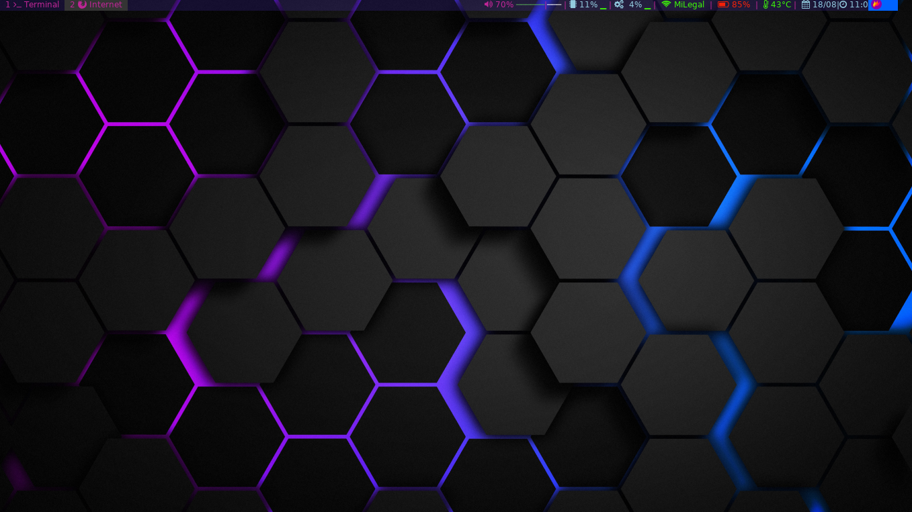

# Main

Here is my i3 config
# Notes
# Install
```bash
sudo add-apt-repository -y ppa:regolith-linux/stable
change jammy -> focal
/usr/lib/apt/apt-helper download-file https://debian.sur5r.net/i3/pool/main/s/sur5r-keyring/sur5r-keyring_2022.02.17_all.deb keyring.deb SHA256:52053550c4ecb4e97c48900c61b2df4ec50728249d054190e8a0925addb12fc6
sudo dpkg -i ./keyring.deb
echo "deb http://debian.sur5r.net/i3/ $(grep '^DISTRIB_CODENAME=' /etc/lsb-release | cut -f2 -d=) universe" >> /etc/apt/sources.list.d/sur5r-i3.list
sudo apt update
sudo apt install i3-gaps
mkdir ~/.config/i3
sudo apt install feh compton рolybar rofi fonts-font-awesome thunar materia-gtk-theme papirus-icon-theme lxappearance arandr
mkdir ~/.config/i3
mkdir ~/.config/i3status
mkdir ~/.config/polybar
mv i3-config ~/.config/i3/config
mv i3status.conf ~/.config/i3status/i3status.conf
mv polybar-config ~/.config/polybar/config
mv launch.sh ~/.config/polybar/launch.sh
mv wallpaper.jpg ~/Downloads/
echo 'setxkbmap -model pc105 -layout us,ru -option grp:win_space_toggle' >> .bashrc
```
Polybar themes `https://github.com/adi1090x/polybar-themes`
